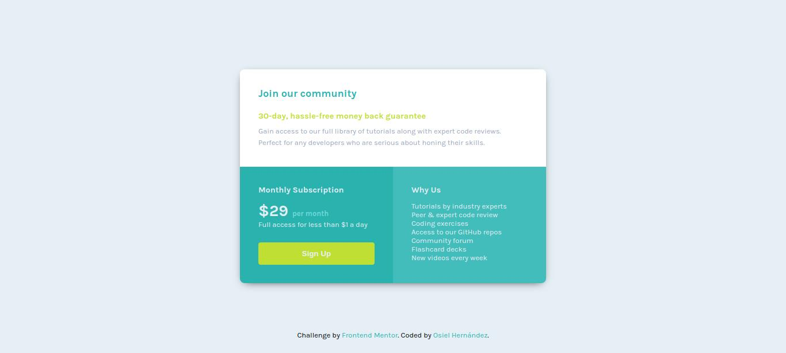

# Frontend Mentor - Single price grid component solution

This is a solution to the [Single price grid component challenge on Frontend Mentor](https://www.frontendmentor.io/challenges/single-price-grid-component-5ce41129d0ff452fec5abbbc). Frontend Mentor challenges help you improve your coding skills by building realistic projects. 

## Table of contents

- [Overview](#overview)
  - [The challenge](#the-challenge)
  - [Screenshot](#screenshot)
  - [Links](#links)
- [My process](#my-process)
  - [Built with](#built-with)
  - [What I learned](#what-i-learned)
  - [Useful resources](#useful-resources)
- [Author](#author)

## Overview

### The challenge

Users should be able to:

- View the optimal layout for the component depending on their device's screen size
- See a hover state on desktop for the Sign Up call-to-action

### Screenshot



### Links

- Solution URL: https://github.com/xXOsielXx/single-price-grid-component-challenge
- Live Site URL: https://xxosielxx.github.io/single-price-grid-component-challenge

## My process

### Built with

- Semantic HTML5 markup
- CSS custom properties
- Flexbox
- CSS Grid
- Mobile-first workflow

### What I learned

In this project I was using CSS Grid for the .price-component layout. I set a template of two columns, and I set two columns for the first section.

```css
@media only screen and (min-width: 600px) {
    .price-component {
        display: grid;
        grid-template-columns: 1fr 1fr;
    }

    #join-our-community {
        grid-column: 1 / 3;
    }
}
```

### Useful resources

- [Perplexity](https://www.perplexity.ai/) - This is a great tool for online search purposes. Thanks to this AI I have been able to find the solution to my code problems very quickly.
- [Stackoverflow](https://stackoverflow.com/) - This is an excelent way to search for solutions. In this popular website I finded solutions to my code problems many times because I'm never the first to have a specific problem appear.

## Author

- Website - [Osiel Hernández](https://xxosielxx.github.io/osez-folio)
- LinkedIn - [Osiel Hernández](https://www.linkedin.com/in/osiel-hern%C3%A1ndez-rodr%C3%ADguez-9869612a1/)
- Github - [@xXOsielXx](https://github.com/xXOsielXx)
- Frontend Mentor - [@xXOsielXx](https://www.frontendmentor.io/profile/xXOsielXx)